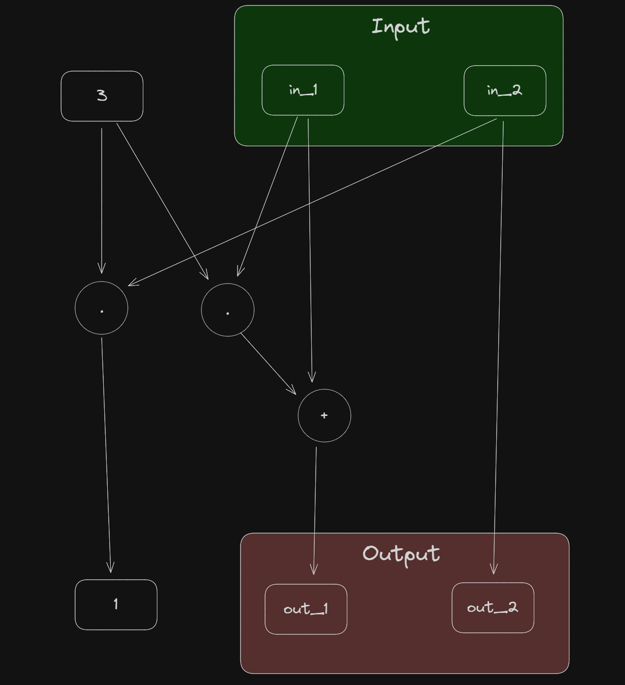

# Chapter 7: Circuit Compiler
---
In this chapter, I've learned:
- 

## **Ex.103**
---


In this brain-compile, ```out_1``` and ```out_2``` compute as follows:
- $out_1 = 3 * in_1 + in_1$
- $1 = 3 * in_2$
- $out_2 = in_2$

## **Ex.104**
---

## **Ex.105**
---

## **Ex.106**
---

## **Ex.107**
---

## **Ex.108**
---

## **Ex.109**
---

## **Ex.110**
---

## **Ex.111**
---

## **Ex.112**
---

## **Ex.113**
---
