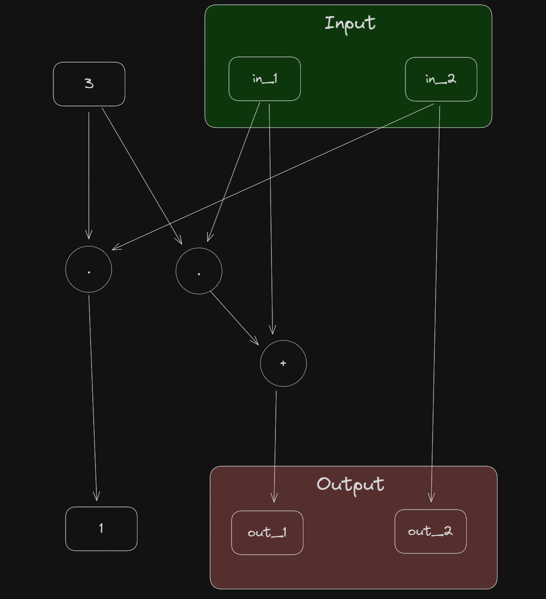

# Chapter 7: Circuit Compiler
---

## Summary
---

This chapter introduced:
- 

### **Ex.103**
---


In this brain-compile, ```out_1``` and ```out_2``` compute as follows:
- $out_1 = 3 * in_1 + in_1$
- $1 = 3 * in_2$
- $out_2 = in_2$

### **Ex.104**
---

The tini_jubjub curve is compute as follows:  
$1+8x^2y^2+10x^2+12y^2$

Here is the code:
```
statement TINI_JJ {F: F_13} {
    fn main(in_1: F, in_2: F) -> (F) {
        let const (c_1, c_2, c_3, c_4) = (1, 8, 10, 12);
        let out: F;
        xx <== MUL(in_1, in_1);
        yy <== MUL(in_2, in_2);
        out <== ADD(c_1, ADD(MUL(MUL(c_2, xx), yy), ADD(MUL(c_3, xx), MUL(c_4, yy))));
        return out;
    }
}

```

## **Ex.105**
---

```
statement sqrt {F: F_13} {
  fn main(y: F) -> (F) {
    let x;
    x <== MUL(y, y);
    return (x);
  }
}
```

## **Ex.106**
---
| $b_1$ | $b_2$ | $1 - (1-b_1)\cdot(1-b_2)$ | $b_1 \lor b_2$ |
|-------|-------|---------------------------|----------------|
| 0     | 0     | 1                         | 1              |
| 0     | 1     | 0                         | 0              |
| 1     | 0     | 0                         | 0              |
| 1     | 1     | 1                         | 1              |

```
fn OR(b1: F, b2: F) -> (F) {
  let out;
  out <== ADD(1, // 1 - (1 - b1)(1 - b2)
    MUL(-1, // - (1 - b1)(1 - b2)
      MUL(  // (1 - b1)(1 - b2)
        ADD(1, MUL(-1, b1)), // 1 - b1
        ADD(1, MUL(-1, b2))  // 1 - b2
      )
    )
  );

  return (x);
}
```

## **Ex.107**
---

## **Ex.108**
---

## **Ex.109**
---

## **Ex.110**
---

## **Ex.111**
---

## **Ex.112**
---

## **Ex.113**
---
