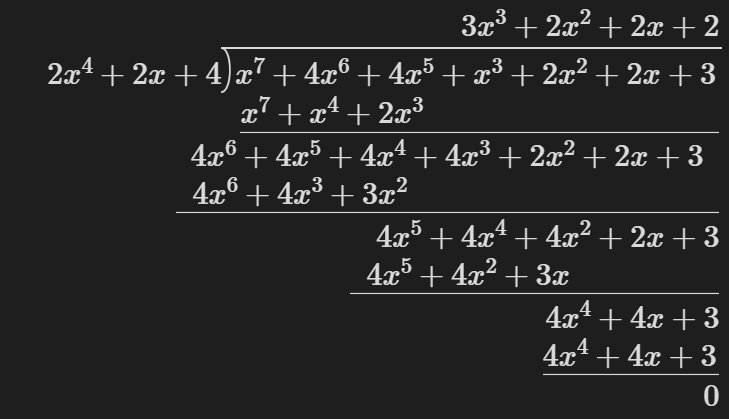

# Chapter 3: Arithmetic

---
In this chapter, I have learned:

- Modulo calculation
- Polynomial

### **Ex.1**

---
$|-123| = 123$, $|27| = 27$, $|0| = 0$

### **Ex.2**

---

$30030=2 \cdot 3 \cdot 5 \cdot 7 \cdot 11\cdot13$

### **Ex.3**

---

1. $x=\varnothing\ |\ x \in \mathbb{N}$
2. $x = -4$

### **Ex.4**

---

1. $x=1$
2. $x=1,x=-1$
3. $x=1,x=-1,x=\frac{1}{2}$

### **Ex.5**

---

1. $m=5,r=2$
2. $m=-5, r=2$ or $m=-6, r=3$
3. $\varnothing$
4. $m=-154,r=7$
5. $\infty$

### **Ex.6**

---

### **Ex.7**

---

### **Ex.8**

---

1. $s=1, t=-4$
2. $s=-5,t=6$
3. $s=1, t=-1$

### **Ex.9**

---

$gcd(n,p)=1$ because $p$ is a prime number, that mean only divided by itself and 1. $n<p$ so that $p$ mod $n$ = 0 can’t
happen.

### **Ex.10**

---

$k\in\{5, 15, 35, 45, 55, 65, 85, 95\}$

### **Ex.11**

---

$gcd(n,m) = g \Rightarrow n=g\cdot n',m=g\cdot m'$  
$gcd(n+m,m)=gcd(g\cdot n'+g\cdot m',g*m')=g$  
So we have $gcd(n,m)=gcd(n+m,m)$

### **Ex.12**

---

$(13,12)$ and $(13,11)$ are pairs of coprime integers.

### **Ex.13**

---

$0o1354=1\cdot8^0+3\cdot8^1+5\cdot8^2+4\cdot8^3=748$  
$0o777=7\cdot8^0+7\cdot8^1+7\cdot8^2=511$

### **Ex.14**

---

1. 5 mod 13 = 5, 19 mod 13 = 6 ⇒ $5\not\equiv19$ (mod 13)
2. 13 $\equiv$ 0 (mod 13)
3. -4 $\equiv$ 9 (mod 13)
4. 0 $\equiv$ 0 (mod 13)

### **Ex.15**

---

$x=6\cdot t + 4$ with $t\in\mathbb{Z} \Rightarrow x\in\{...,-8, -2, 4, 10, ... \}$

### **Ex.16**

---

$5x+4\equiv28+2x$ (mod $13$)  
$\Leftrightarrow 3x \equiv 24$ (mod $13$)  
$\Leftrightarrow x \equiv 8$ (mod $13$) since $gcd(8, 13) = 1$  
$\Rightarrow x = \{13t+8\ |\ t\in \mathbb{Z}\}$  

### **Ex.17**

---

$69x\equiv5$ (mod $23$) $\Leftrightarrow 0x\equiv5$ (mod $23$) ⇒ no solution.

### **Ex.18**

---

$69x\equiv46$ (mod $23$) $\Leftrightarrow 0x \equiv0$ (mod $23$) ⇒ all solutions.

### **Ex.19**

---

We have $a^k \equiv a$ (mod $n$), $b^k \equiv b$ (mod $n$) (Fermat’s Litter Theorem), $a\equiv b$ (mod $n$).
So that $a^k\equiv b^k$ (mod $n$).

### **Ex.20**

---

### **Ex.21**

---

$5x+4\equiv28+2x$ (mod $13$) over $\mathbb{Z}_{13}$  
$\Leftrightarrow3x\equiv11$ (mod $13$)  
$\Leftrightarrow$ $x\equiv99$ (mod $13$)  
$\Leftrightarrow$ $x\equiv8$ (mod $13$)  
$\Leftrightarrow$ $x=\{13t+8\ |\ t \in \mathbb{Z}\}$  

### **Ex.22**

---

$7\cdot7=1$ in $Z_{24}$  
$1\cdot1=1$ in $Z_{24}$  
$0$ don't have inverse in $Z_{24}$
$805\cdot13=1$ in $Z_{24}$
$-4255\cdot17=1$ in $Z_{24}$

### **Ex.23**

---

$17(2x+5)−4≡2x+4$ (mod $5$)  
$\Leftrightarrow$ $2(2x+0)+1\equiv2x+4$ (mod $5$)  
$\Leftrightarrow$ $2x\equiv3$ (mod $5$)  
$\Leftrightarrow$ $x\equiv4$ (mod $5$)  

### **Ex.24**

---

$17(2x+5)−4≡2x+4$ (mod $6$)  
$\Leftrightarrow$ $5(2x+5)+2\equiv2x+4$ (mod $6$)  
$\Leftrightarrow$ $4x+3\equiv2x+4$ (mod $6$)  
$\Leftrightarrow$ $2x\equiv1$ (mod $6$)  
$\Leftrightarrow$ no solution because left-hand side is an even number, right-hand side is an odd number.

### **Ex.25**

---

By projecting coefficients from $P_7$ in $Z$ to $P_7$ in $Z_6$, we have the same results as the example.

### **Ex.26**

---

By projecting coefficients from the computations in $Z$ to $Z_6$, we have the results as the example. We don't need to
project coefficients steps by steps.

### **Ex.27**

---

1. 
  
$Q(x) = -3x^2-8x-24$  
$R(x)=-80x+52$  

2. We can project the results from $Z$ to $Z_6$  
 $Q(x)=3x^2+4x$  
 $R(x)=4x+4$

3. Similar to 2, we can project the results from $Z$ to $Z_5$
 $Q(x)=2x^2+2x+1$
 $R(x)=2$

### **Ex.28**

---
Projecting the polynomials from $Z$ to $Z_5$ we have:  
 $B(x)=2x^4+2x+4$  
 $A(x)=x^7+4x^6+4x^5+x^3+2x^2+2x+3$  
After that we calculate the long division:  
  
So we have
$Q(x)=3x^3+2x^2+2x+2$  
$R(x)=0$  

### **Ex.29**

---

### **Ex.30**

---
Use ```Sage``` or anything to compute the root of this polynomial (I used [Symbolab](https://www.symbolab.com/)), we have the result: $x=1$ or
$x=-1$. However, this is the root in $Z$. By projecting this result from $Z$ to $Z_6$ we have final result: $x=1$ or
$x=5$.

### **Ex.31**

---
$l_0(x)=\frac{x-x_1}{x_0-x_1}\cdot\frac{x-x_2}{x_0-x_2}\cdot\frac{x-x_3}{x_0-x_3}=4x^3+x^2+4x+1$
$l_1(x)=\frac{x-x_0}{x_1-x_0}\cdot\frac{x-x_2}{x_1-x_2}\cdot\frac{x-x_3}{x_1-x_3}=3x^3+3x$  
$l_2(x)=\frac{x-x_1}{x_2-x_1}\cdot\frac{x-x_0}{x_2-x_0}\cdot\frac{x-x_3}{x_2-x_3}=2x^3+2x^2+x$  
$l_3(x)=\frac{x-x_1}{x_3-x_1}\cdot\frac{x-x_2}{x_3-x_2}\cdot\frac{x-x_0}{x_3-x_0}=x^3+2x^2+2x$  
$P(x)=y_0\cdot l_0+y_1\cdot l_1+y_2\cdot l_2+y_3\cdot l_3=4x^3+3x^2+4x$

Note that in each steps, I projected coefficients from $Z$ to $Z_6$.

### **Ex.32**

---
We can't apply Lagrange Interpolation to construct a polynomial $P\in Z_6$ because not all elements in $Z_6$ have
multiplicative inverse.
