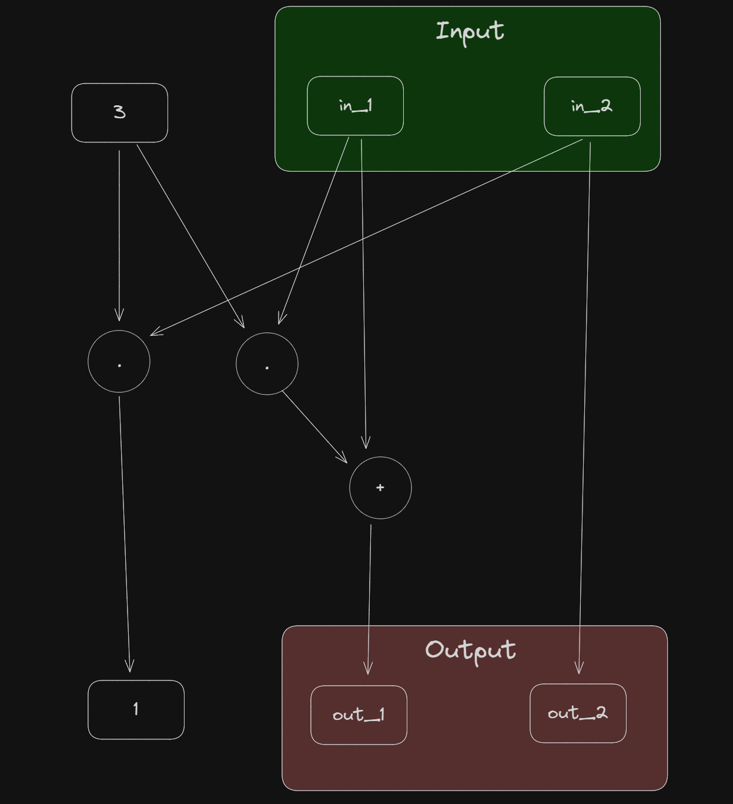

# Chapter 7: Circuit Compiler
---
In this chapter, I've learned:
- 

## **Ex.103**
---


In this brain-compile, ```out_1``` and ```out_2``` compute as follows:
- $out_1 = 3 * in_1 + in_1$
- $1 = 3 * in_2$
- $out_2 = in_2$

## **Ex.104**
---

The tini_jubjub curve is compute as follows:  
$1+8x^2y^2+10x^2+12y^2$

Here is the code:
```
statement TINI_JJ {F: F_13} {
    fn main(in_1: F, in_2: F) -> (F) {
        let const (c_1, c_2, c_3, c_4) = (1, 8, 10, 12);
        let out: F;
        xx <== MUL(in_1, in_1);
        yy <== MUL(in_2, in_2);
        out <== ADD(c_1, ADD(MUL(MUL(c_2, xx), yy), ADD(MUL(c_3, xx), MUL(c_4, yy))));
        return out;
    }
}

```

## **Ex.105**
---

```
statement sqrt {F: F_13} {
  fn main(y: F) -> (F) {
    let x;
    x <== MUL(y, y);
    return (x);
  }
}
```

## **Ex.106**
---

## **Ex.107**
---

## **Ex.108**
---

## **Ex.109**
---

## **Ex.110**
---

## **Ex.111**
---

## **Ex.112**
---

## **Ex.113**
---
