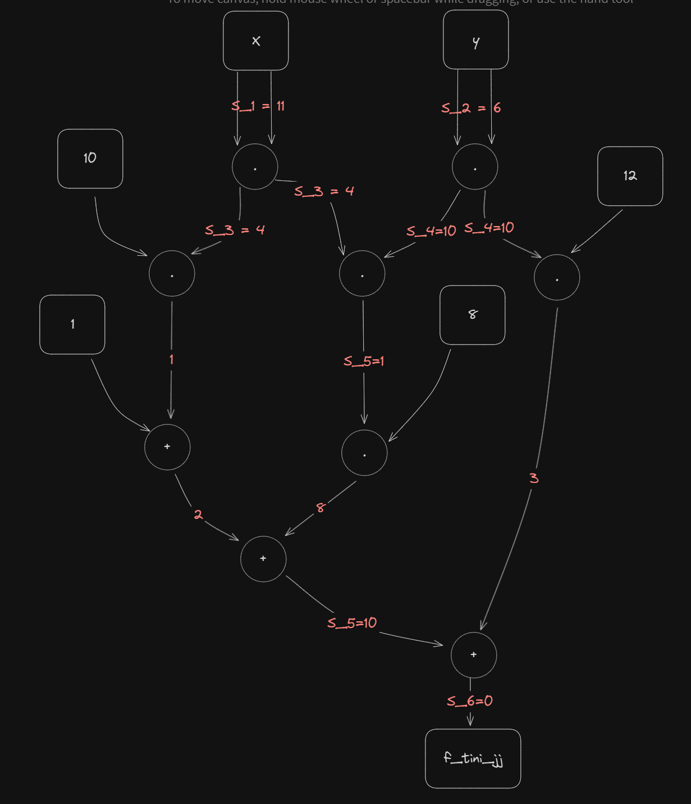

# Chapter 6: Statements

---

## Summary

---
This chapter introduced:
- **Formal Language**
  - Decision function
  - Instance and Witness
  - Modularity
- **Statement Representation**
  - Rank-1 Quadratic Constraint Systems
  - Algebraic Circuits
  - Quadratic Arithmetic Programs

### **Ex.96**

---
Here I define language $L_{exercise1}$ and its decision function:  

$$
R_{Exercise1} : (\mathbb{F}_{13})^* \to \{true, false\};
$$

$$
\langle x_1, \ldots, x_n \rangle\mapsto
\begin{cases}
true & n = 1 \text{ and } 5x_1+4 = 28 + 2x_1 \\ 
false & else
\end{cases}
$$

By solving this equation in a normal way, I got the solution $x=8$ is a constructive proof, and 
$R_{exercise1}(\langle8\rangle)=true$ verify this proof.

### **Ex.97**

---
Solving the equation $3x+3=0$ in $`\mathbb{Z}_6`$ , we have the solutions $\langle1\rangle$ and $\langle5\rangle$. 
Because the decision function require $n=1$ so we have 2 proofs, and $R_{exercise1}(\langle1\rangle)=true$ and 
$R_{exercise1}(\langle5\rangle)=true$ verify these proof.

### **Ex.98**

---
Solving the equation in each case, we have:

- $(3,3,0)$ have $1$ as witness (or $5$).
- $(2,1,0)$ have no witness.
- $(4,4,2)$ have 1 as witness.

### **Ex.99**

---
I define instance is composited of 2 points, and witness is 1 point holds that:  
$`\sum_i = \mathbb{F}_{13}`$ and $`\sum_w = \mathbb{F}_{13}`$  
Our grammar define as follows:  
$`R_{add} :(\mathbb{F}_{13})^*\times(\mathbb{F}_{13})^*\to\lbrace true,false\rbrace;`$

$$  
(i, w)
\mapsto
\begin{cases}
true & (\langle i_1, i_2 \rangle) \in L_{tiny-jj} \ & \text{ and } &(\langle i_3, i_4 \rangle) \in L_{tiny-jj} \ 
& \text{ and } &(w_1, w_2) = \left( \frac {i_1i_4 + i_2i_3} {1 + 8i_1i_3i_2i_4} , 
\frac {i_2i_4 - 3i_1i_3} {1 - 8i_1i_3i_2i_4} \right) \\
false & else
\end{cases}
$$

To get the constructive proof that verifiable, choose 2 points on curve as instance and compute their sum as witness. 
In the other side, choose 1 point outside the curve and 1 point on curve, we will have 1 instance that can't provide a 
proof.

### **Ex.100**

---
 As showed in the previous example, I define 2 equations:  
 $x_3=\frac{x_1y_2 + x_2y_1}{1+8x_1x_2y_1y_2}$ and $y_3 = \frac{y_1y_2-3x_1x_2}{1-8x_1x_2y_1y_2}$.  
 Rewrite:  
 $x_3(1+8x_1x_2y_1y_2)=x_1y_2+x_2y_1$ and  
 $y_3(1-8x_1x_2y_1y_2)=y_1y_2-3x_1x_2$.  
 Define constraints, witnesses and instances:  
 
 $$
 \begin{aligned}  
 W_1 = x_1 \cdot y_2 \\  
 W_2 = x_2 \cdot y_1 \\  
 W_3 = x_1 \cdot x_2 \\  
 W_4 = y_1 \cdot y_2 \\
 W_5 = 8 \cdot W_1 \cdot W_2 \\
 x_3(1+W_5) = W_1 + W_2 \\
 y_3(1-W_5) = W_4 - 3\cdot W_3  
 \end{aligned}
 $$
   
 I define $x_3=W6,y_3=W_7$, and I have the result as below, follow by columns explanations:
 $`\text{constant}\ |\ x_1\ |\ x_2\ |\ y_1\ |\ y_2\ |\ W_1\ |\ W_2\ |\ W_3\ |\ W_4\ |\ W_5\ |\ x_3\ |\ y_3`$ 
  
 $$
 A=\begin{pmatrix}
 0&1&0&0&0&0&0&0&0&0&0&0 \\
 0&0&1&0&0&0&0&0&0&0&0&0 \\
 0&1&0&0&0&0&0&0&0&0&0&0 \\
 0&0&0&1&0&0&0&0&0&0&0&0 \\
 0&0&0&0&0&8&0&0&0&0&0&0 \\
 1&0&0&0&0&0&0&0&0&1&0&0 \\
 1&0&0&0&0&0&0&0&0&-1&0&0 \\
 \end{pmatrix}
 $$  
 $$
 B=\begin{pmatrix}
 0&0&0&0&1&0&0&0&0&0&0&0 \\
 0&0&0&1&0&0&0&0&0&0&0&0 \\
 0&0&1&0&0&0&0&0&0&0&0&0 \\
 0&0&0&0&1&0&0&0&0&0&0&0 \\
 0&0&0&0&0&0&1&0&0&0&0&0 \\
 0&0&0&0&0&0&0&0&0&0&1&0 \\
 0&0&0&0&0&0&0&0&0&0&0&1 \\
 \end{pmatrix}
 $$
 
   $$  
 C=\begin{pmatrix}
 0&0&0&0&0&1&0&0&0&0&0&0 \\
 0&0&0&0&0&0&1&0&0&0&0&0 \\
 0&0&0&0&0&0&0&1&0&0&0&0 \\
 0&0&0&0&0&0&0&0&1&0&0&0 \\
 0&0&0&0&0&0&0&0&0&1&0&0 \\
 0&0&0&0&0&1&1&0&0&0&0&0 \\
 0&0&0&0&0&0&0&-3&1&0&0&0 \\
 \end{pmatrix}
 $$

### **Ex.101**

---

Follow the execution, we have the proof $\pi=\langle11, 6, 4, 10, 10, 0\rangle$.  

### **Ex.102**

---
